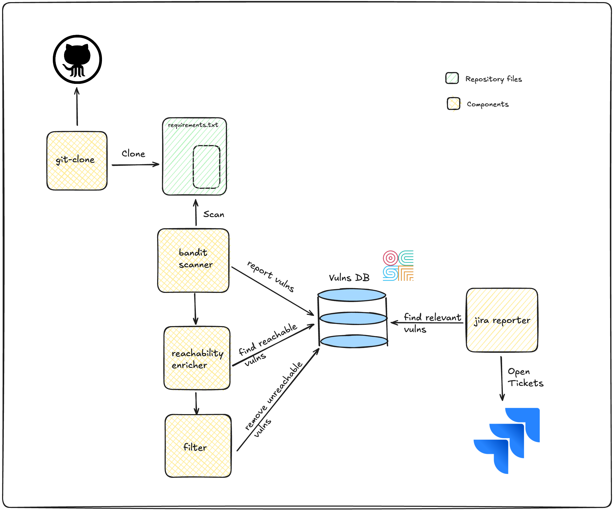

# Architecture

Smithy is a workflow engine for security tooling powered by [smithy.security](https://smithy.security/)
that automates security teams' frameworks built on top of [Open Cybersecurity Schema Framework](https://github.com/ocsf).

Smithy organises workflows in components.

## Workflows and Components

Workflows are a set of two or more components. Each component wraps a different security tool or
contains some business logic, for example parsing a scanner's output.

Components can be of different types:

* `targets`: prepare a target to be scanner - for example cloning a repository
* `scanners`: scan a target with a specific tool - for example [gosec](https://github.com/securego/gosec) and produce
  findings in [OCSF](https://github.com/ocsf) format.
* `enrichers`: enrich findings with extra information - for example reachability tags.
* `filters`: filter out findings based on some criteria - for example exclude unreachable findings
  from being reported.
* `reporters`: report the findings into some destination - for example [JIRA](https://www.atlassian.com/software/jira).

A workflow can contain one or many different components of the same type.

## Execution

Workflows are executed in instances in the following order: *targets > scanners > enrichers > filters > reporters*.

Here you can see an example workflow:

Findings are persisted in an underlying database (locally [SQLite](https://www.sqlite.org/)) in OCSF JSON format. This format is used by each
Smithy's component to do their job.

The components are containerised and can be orchestrated on any platform.
Locally we use [Docker](https://www.docker.com/).
